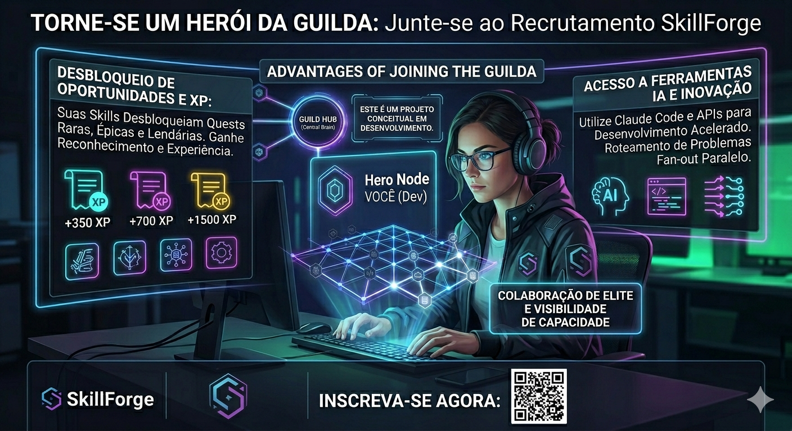
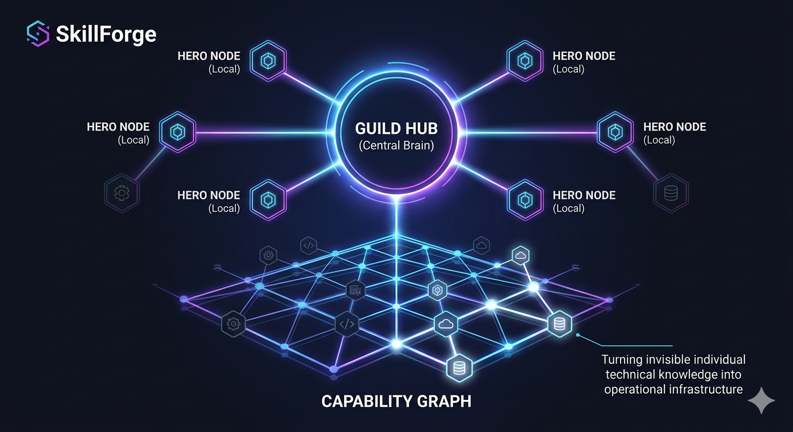
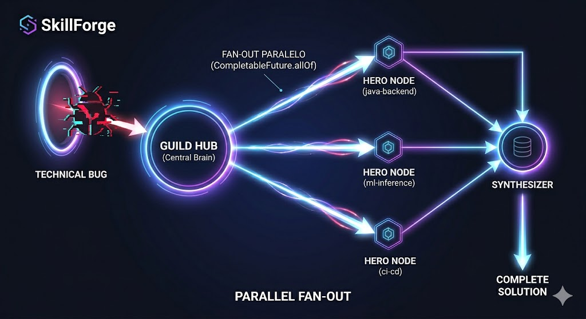

# SkillForge

> Transformando as habilidades de uma equipa de developers em uma guilda capaz de descobrir, desbloquear e resolver problemas de negócio em tempo real.



---

## Navegação

| | Documento | Para quem |
|---|---|---|
| 🚪 | [GUILD_ONBOARDING.md](GUILD_ONBOARDING.md) | Novo na guilda? Comece aqui. |
| ⚔️ | [QUEST_BOARD.md](QUEST_BOARD.md) | Tasks por nível com critérios de aceitação. |
| 🧬 | [SKILL_MANIFEST_GUIDE.md](SKILL_MANIFEST_GUIDE.md) | Como declarar e validar suas skills. |
| 🏰 | [guild-hub/README.md](guild-hub/README.md) | Orquestrador central — API, fluxo fork→registro, SSE. |

---

## O que é

O **SkillForge** é uma plataforma de capacidade coletiva orientada a skills.

Cada developer roda um **nó herói** localmente. Esse nó se registra num **Guild Hub** central, que mantém um grafo determinístico das capacidades da equipa, roteia problemas para os heróis certos em paralelo e emite notificações em tempo real quando novas skills desbloqueiam novas possibilidades.

O objetivo não é apenas gamificar colaboração — é transformar especialização técnica em infraestrutura operacional.

---

## O problema

Em muitas equipas, capacidade técnica fica invisível:

- conhecimento individual não formalizado
- especializações implícitas que dependem de coordenação manual
- ninguém sabe exatamente o que o grupo consegue resolver agora
- onboarding lento, gargalos em especialistas, baixo paralelismo

O time possui capacidade. Mas não consegue usá-la como sistema.

---

## Resultado esperado

> Esta imagem estabelece a base do conceito. Ela visualiza o Guild Hub central conectando os Nós Heróis locais. O ponto focal é o Capability Graph (Grafo de Capacidade), que transforma o conhecimento técnico — antes invisível e desconectado — em uma infraestrutura operacional visível e estruturada. Os hexágonos representam as skills, que acendem e se conectam conforme são formalizadas pelo sistema.



> Esta imagem ilustra o fluxo de execução técnica do sistema. Ela demonstra o mecanismo de Fan-Out Paralelo. Um problema técnico complexo (o artefato vermelho no portal) é submetido ao Guild Hub. O Hub, utilizando o grafo de capacidade (visto na imagem anterior), identifica e aciona simultaneamente múltiplos Nós Heróis relevantes. Vemos raios de energia ativando nós com skills específicas (java-backend, ml-inference, ci-cd). As respostas emergem em paralelo e convergem no Sintetizador para gerar a solução final.



> Esse é o ponto em que capacidade deixa de ser atributo humano e passa a ser comportamento emergente do sistema.

---

## Como funciona

```
Dev sobe nó herói  →  herói registra skills no Guild Hub
                   →  hub atualiza o Capability Graph
                   →  quests pendentes são reavaliadas
                   →  SSE notifica toda a guilda em tempo real

Problema submetido →  hub seleciona heróis relevantes
                   →  fan-out paralelo (CompletableFuture.allOf)
                   →  sintetizador combina respostas
                   →  XP distribuído, audit trail persistido
```

---

## Mecânicas de jogo

### Raridade das quests

| Raridade | Skills necessárias | XP | Quem pode ver |
|---|---|---|---|
| COMMON | 1–2 | 50–200 | Apprentice+ |
| RARE | 3–4 | 200–500 | Journeyman+ |
| EPIC | 5–6 | 500–1000 | Expert+ |
| LEGENDARY | 6+ | 1000+ | Master+ |

Ver todas as quests disponíveis → [QUEST_BOARD.md](QUEST_BOARD.md)

### Progressão do herói

| Nível | Nome | XP | O que desbloqueia |
|---|---|---|---|
| 1 | Apprentice | 0 | Quests COMMON |
| 3 | Journeyman | 1.000 | Quests RARE + arquitetura |
| 5 | Expert | 3.000 | Quests EPIC + métricas da guilda |
| 8 | Master | 8.000 | Quests LEGENDARY + mentoria |
| 10 | Archmage | 20.000 | Define skills, aprova quests |

### Distribuição de XP

- skills `required` → XP base ÷ nº heróis × 1.2
- skills `optional` → XP base ÷ nº heróis × 0.6
- bônus de velocidade → top 25% mais rápidos recebe +10%
- sintetizador → 15% fixo por quest

---

## Arquitetura

```
Frontend (SSE) → Guild Hub :8080 → CompletableFuture.allOf()
                                  → Herói :8081 (phi3:mini)
                                  → Herói :8082 (phi3:mini)
                                  → Herói :8083 (phi3:mini)
                                  → Sintetizador :8090 (qwen2.5:7b)
```

### Stack

- **Java 21** — Records, Virtual Threads, HttpClient nativo
- **Spring Boot 3.3** — `spring-boot-starter-web` + Thymeleaf
- **Ollama** — `phi3:mini` por nó herói · `qwen2.5:7b` no sintetizador
- **SQLite** — persistência local de heróis, quests, XP e audit trail
- **GitHub** — fonte de verdade para quests e membros da guilda
- **Maven multi-módulo** — `hero-template` · `guild-hub` · `synthesizer` · `core` · `api`

### Contratos base

```java
record HeroManifest(String heroId, String heroName, String heroClass,
    List<String> skills, String endpoint, String model, String specialty,
    int level, int xp)

record AgentOutput(String result, double confidence, String reason, String agentId)

record QuestUnlockedEvent(String questId, String title, QuestRarity rarity,
    String unlockedBy, int xpReward)
```

---

## Princípios de design

- **Sem LLM no roteamento** — o Capability Graph é determinístico, Java puro
- **Contratos imutáveis** — comunicação modelada com Java Records
- **Resultado parcial avança** — timeouts e respostas degradadas fazem parte do design
- **Local-first** — modelos via Ollama, dados não saem da máquina
- **Cada dev é owner do seu herói** — nó independente, porta própria, autonomia total
- **Crescimento orgânico** — o sistema só resolve o que as skills disponíveis permitem

---

## Roadmap

### Fase 1 — Herói mínimo
- [x] template do nó herói com Spring Boot 3.3 / Java 21
- [x] dashboard web com dados da guilda via GitHub API
- [x] `/api/health`, `/api/manifest`, `/events` (SSE)
- [ ] integração Ollama em `/api/solve`

### Fase 2 — Guild Hub core
- [ ] endpoint de registro de heróis
- [ ] Capability Graph determinístico
- [ ] fan-out paralelo com `CompletableFuture`
- [ ] SSE broadcast de quests desbloqueadas

### Fase 3 — Gamificação completa
- [ ] XP engine e leaderboard
- [ ] Skill Gap Dashboard
- [ ] Training Dojo
- [ ] notificações automáticas por herói

### Fase 4 — Produto
- [ ] submissão de quests via API
- [ ] marketplace de capacidades
- [ ] múltiplos domínios de negócio

---

## Para começar

Leia [GUILD_ONBOARDING.md](GUILD_ONBOARDING.md) — tem os passos concretos para subir seu nó herói e se registrar na guilda.

Se quiser o fluxo completo com exemplo de issue de registro (prefixo `[HERO-REGISTRATION]`), veja [HERO_REGISTRATION.md](HERO_REGISTRATION.md).

Declare suas skills em [SKILL_MANIFEST_GUIDE.md](SKILL_MANIFEST_GUIDE.md) antes de registrar.

Escolha sua primeira quest em [QUEST_BOARD.md](QUEST_BOARD.md).

---

## Contribuição

Contribuições são bem-vindas em:

- modelação de capability graphs
- orquestração paralela entre agentes
- agentes locais com Ollama
- gamificação aplicada à colaboração técnica
- visibilidade operacional de skills e lacunas

Abra uma issue ou inicie uma discussão.

---

## Status

Fase 1 em construção. Hero template funcional com dashboard web e integração GitHub API.

Apresentação do projeto em [SkillForge](https://docs.google.com/presentation/d/1vWHbvu2ogMNudlQgvaOb-fZGpCl-LBP3CgbxnvFVz6U/edit?usp=sharing).